# 🛒 Supermarket Sales Analysis


---

# 📌 Project Overview

The **Supermarket Sales Analysis** project is an Exploratory Data Analysis (EDA) project built using **Python, Pandas, NumPy, and Matplotlib**.

The objective of this project is to analyze supermarket sales data and uncover valuable business insights regarding customer purchasing behavior, product performance, payment methods, sales trends, and branch performance.

The analysis helps businesses make data-driven decisions to improve sales, customer satisfaction, inventory management, and marketing strategies.

---

# 🎯 Business Objectives

- Analyze overall supermarket sales performance
- Identify the highest-selling product lines
- Find sales distribution by weekday
- Analyze customer purchasing behavior
- Compare branch performance
- Compare city-wise sales
- Analyze payment methods
- Analyze gender-wise sales
- Analyze customer type performance
- Discover peak shopping time periods
- Visualize sales trends using charts

---

# 📂 Dataset

**Dataset Name**

```
SuperMarket.csv
```

The dataset contains transactional information collected from supermarket branches.

### Main Columns

| Column | Description |
|---------|-------------|
| Invoice ID | Unique invoice number |
| Branch | Store branch |
| City | Store city |
| Customer type | Member / Normal |
| Gender | Customer gender |
| Product line | Product category |
| Unit price | Price of product |
| Quantity | Quantity purchased |
| Tax 5% | Tax amount |
| Sales | Total sales amount |
| Date | Purchase date |
| Time | Purchase time |
| Payment | Payment method |
| Rating | Customer rating |

---

# 🛠 Technologies Used

- Python
- Pandas
- NumPy
- Matplotlib
- Jupyter Notebook

---

# 📊 Data Analysis Performed

## 📅 1. Sales by Day

Calculates total sales for every weekday to determine which day generates the highest revenue.

**Visualization**

- Bar Chart

---

## 🛍 2. Revenue by Product Line

Finds the product line that contributes the highest sales revenue.

**Visualization**

- Bar Chart

---

## 📦 3. Quantity Sold by Product Line

Analyzes which product line sells the highest number of units.

**Visualization**

- Bar Chart

---

## 💳 4. Payment Method Analysis

Analyzes sales made using different payment methods such as:

- Cash
- Credit Card
- Ewallet

**Visualizations**

- Bar Chart
- Pie Chart

---

## 👨‍👩‍👧 5. Gender-wise Sales Analysis

Compares sales generated by Male and Female customers.

**Visualizations**

- Bar Chart
- Pie Chart

---

## ⏰ 6. Sales by Time Period

Orders are categorized into four time periods:

- Morning
- Afternoon
- Evening
- Night

This helps identify peak shopping hours.

**Visualization**

- Pie Chart

---

## 👥 7. Customer Type Analysis

Compares average sales between

- Members
- Normal Customers

**Visualization**

- Bar Chart

---

## 🏙 8. City-wise Sales

Analyzes which city contributes the highest supermarket sales.

**Visualizations**

- Vertical Bar Chart
- Horizontal Bar Chart

---

## 🏪 9. Branch-wise Sales

Compares total sales among different supermarket branches.

**Visualizations**

- Bar Chart
- Pie Chart

---

## 📈 10. Daily Sales Trend

Shows how sales change over time.

**Visualization**

- Line Chart

---

# 📊 Visualizations

## 📅 Sales by Day

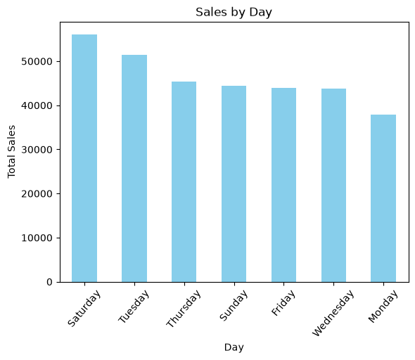

---

## 💰 Revenue by Product Line

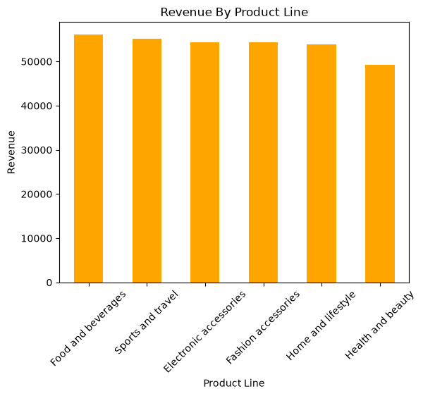

---

## 📦 Quantity Sold by Product Line

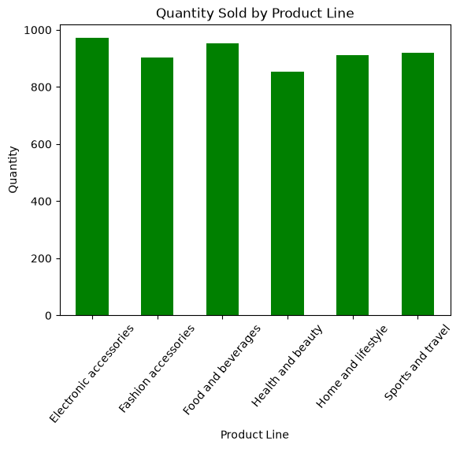

---

## ⏰ Sales by Time Period

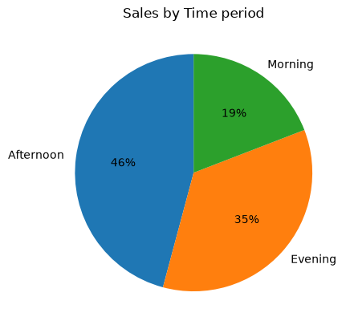

---

## 💳 Sales by Payment Method

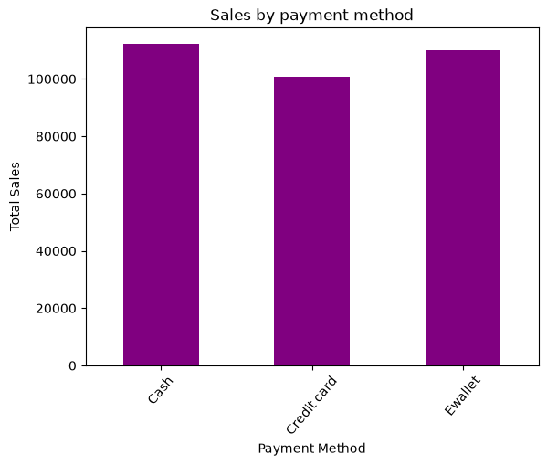

---

## 💳 Payment Method Distribution

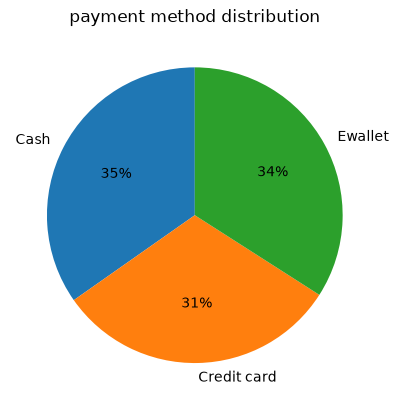

---

## 👨 Sales by Gender

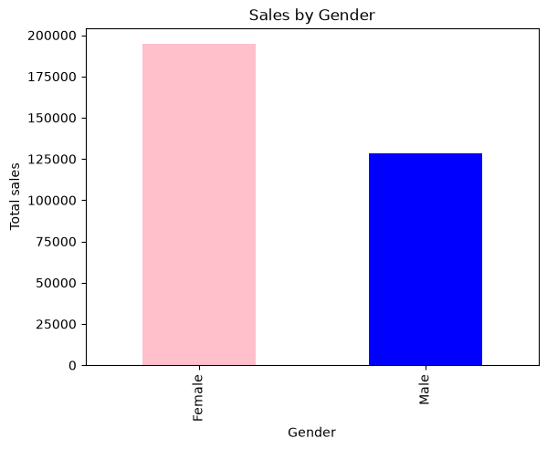

---

## 👩 Gender-wise Sales

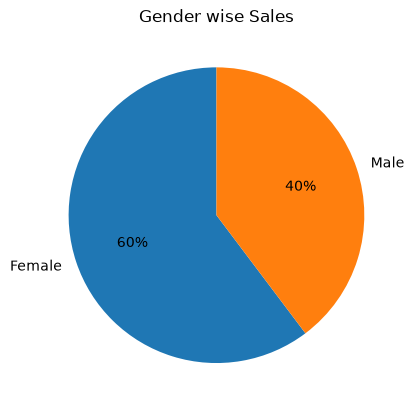

---

## 🏙 Sales by City

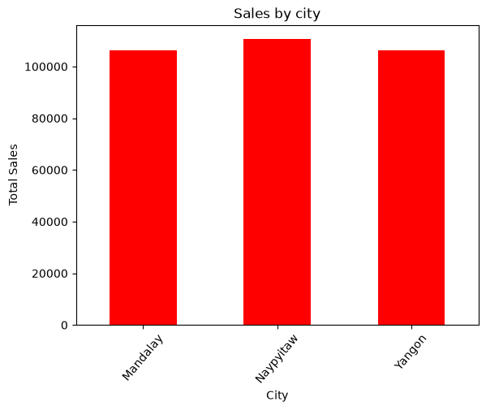

---

## 🌆 City-wise Sales

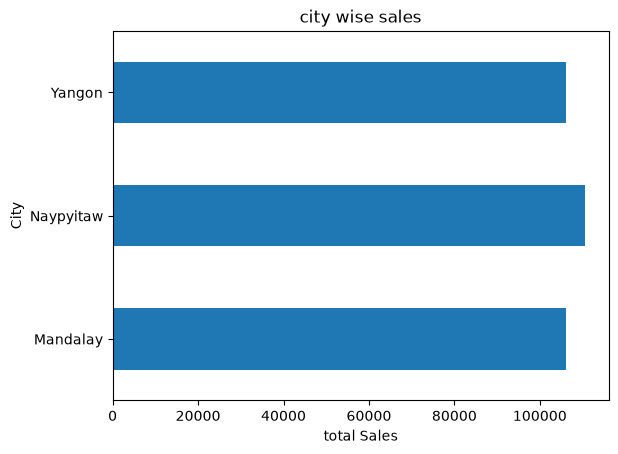

---

## 🏪 Sales by Branch

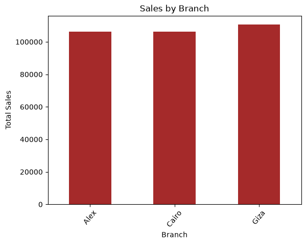

---

## 🏢 Branch-wise Sales

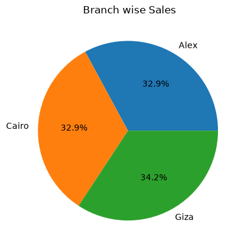

---

## 👥 Average Sale by Customer Type

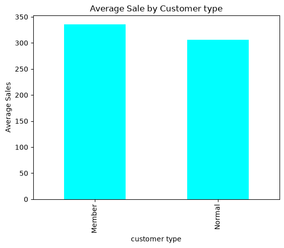

---

## 📈 Daily Sales Trends

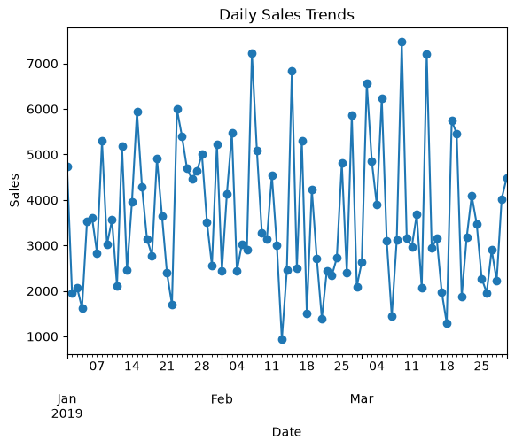

---

# 📈 Key Insights

- Product lines contribute differently to total sales.
- Certain weekdays generate significantly higher revenue.
- Evening shopping contributes a large percentage of sales.
- Members generally spend more than normal customers.
- Cash, Credit Card, and Ewallet are all popular payment methods.
- Sales performance varies across branches and cities.
- Customer purchasing behavior changes throughout the day.

---

# 💡 Business Recommendations

- Increase inventory for high-selling product lines.
- Schedule more staff during peak shopping hours.
- Launch promotions during low-sales periods.
- Improve marketing for underperforming product categories.
- Encourage membership programs to increase average spending.
- Optimize branch inventory based on regional demand.

---

# ▶️ How to Run the Project

## Clone Repository

```bash
git clone https://github.com/yourusername/Supermarket-Sales-Analysis.git
```

---

## Install Required Libraries

```bash
pip install pandas numpy matplotlib
```

---

## Run

Open

```
SuperMarket_Sales_Analysis.ipynb
```

Run all cells.

---

# 📁 Project Structure

```text
Sales Data Analysis Project/
│
├── Dataset/
│   └── SuperMarket.csv
│
├── images/
│   ├── Averege_Sale_by_CustomerType.png
│   ├── Branch_wise_sales.png
│   ├── City_wise_sales.png
│   ├── Daily_Sales_trends.png
│   ├── Gender_wise_sales.png
│   ├── Payment_method_distributions.png
│   ├── Quantity_Sold_by_product_line.png
│   ├── Revenue_By_ProductLine.png
│   ├── Sales_by_branch.png
│   ├── Sales_by_City.png
│   ├── Sales_By_Day.png
│   ├── Sales_by_Gender.png
│   ├── Sales_by_payment_method.png
│   └── Sales_by_Time_period.png
│
├── SuperMarket.csv
├── SuperMarket_Sales_Analysis.ipynb
├── README.md
└── requirements.txt
```

---

# 📚 Python Concepts Used

- Data Cleaning
- Data Preprocessing
- Missing Value Handling
- Date & Time Handling
- Functions
- Custom Functions
- GroupBy
- Aggregation
- Sorting
- Filtering
- Data Visualization
- Exploratory Data Analysis (EDA)

---

# 🚀 Future Improvements

- Interactive Dashboard using Streamlit
- Power BI Dashboard
- Plotly Interactive Charts
- Sales Forecasting using Machine Learning
- Customer Segmentation
- Profit Analysis
- Monthly & Yearly Reports
- KPI Dashboard
- Customer Retention Analysis

---

# 👨‍💻 Author

## Rajesh Kumar Patra

**BCA Graduate | Python Developer | Data Analyst**

### Skills

- Python
- Pandas
- NumPy
- Matplotlib
- SQL
- Excel
- Power BI
- Data Analysis
- Data Visualization

---

⭐ **If you found this project useful, please consider giving it a Star ⭐ on GitHub!**
